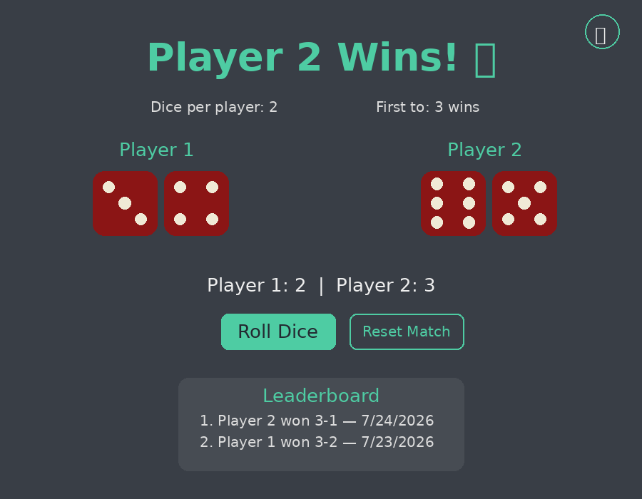

# 🎲 Dicee

A two-player dice-rolling game built with vanilla HTML, CSS, and JavaScript — now with best-of-N tournaments, sound effects, and a persistent leaderboard.



> The image above is a static mockup of the UI. Swap it for a real screen recording (e.g. via [ScreenToGif](https://www.screentogif.com/) or [Kap](https://getkap.co/)) for the most accurate preview.

## Features

- 🎯 **Roll Dice button** — no more full-page refresh, rolls happen instantly with a shake animation
- 🏆 **Best-of-N matches** — choose first to 1, 3, or 5 wins; a reset button starts a new match
- 🔢 **Configurable dice count** — play with 1, 2, or 3 dice per player (totals are summed)
- 🔊 **Sound effects** — a shake sound on roll and a chime on match win (generated with the Web Audio API, no audio files needed)
- 📊 **Live score tracker** — shows each player's round wins throughout the match
- 📋 **Local leaderboard** — match results persist across sessions via `localStorage`
- 🌗 **Dark / light theme toggle** — preference is remembered on your next visit
- 📱 **Responsive layout** — dice stack vertically and text scales down on mobile
- 📲 **Installable PWA** — add it to your phone or desktop home screen and play offline (via `manifest.json` + a service worker)

## Project Structure

```
Dice-Game/
├── index.html        # Main HTML page
├── styles.css         # Styling, theme variables, animations, responsive layout
├── index.js           # Game logic: rolling, scoring, sound, leaderboard, theme
├── favicon.svg         # Site favicon
├── manifest.json        # Web App Manifest (PWA installability)
├── service-worker.js    # Offline caching for core assets
├── icons/
│   ├── icon-192.png     # PWA icon (192x192)
│   └── icon-512.png     # PWA icon (512x512)
├── assets/
│   ├── og-image.png    # Open Graph / social share preview image
│   └── preview.png     # README preview screenshot
└── images/
    └── dice1.png … dice6.png   # Dice face images
```

## How It Works

1. Choose how many dice each player rolls, and how many round wins are needed to win the match.
2. Click **Roll Dice** — both players' dice animate and land on a random result.
3. Whoever has the higher total wins the round; round wins are tracked live.
4. First to reach the target number of wins takes the match, and the result is saved to the leaderboard.
5. Click **Reset Match** to play again, or **Clear leaderboard** to wipe saved history.

## Running Locally

1. Clone the repository:
   ```bash
   git clone https://github.com/Jay-ARORA-5572/Dice-Game.git
   ```
2. Open `index.html` in your browser (no build step or server required).
3. Click **Roll Dice** to play.

## Installing as an App

Dicee is a Progressive Web App — no app store required:

- **On mobile (Chrome/Safari):** open the hosted site, then use "Add to Home Screen" from the browser menu.
- **On desktop (Chrome/Edge):** click the install icon in the address bar, or the browser menu's "Install Dicee" option.

Once installed, it works offline and launches in its own window like a native app.

## Tech Stack

- HTML5
- CSS3 (custom properties for theming, keyframe animations, media queries)
- Vanilla JavaScript (Web Audio API for sound, `localStorage` for persistence)

## Credits

Fonts: [Indie Flower](https://fonts.google.com/specimen/Indie+Flower) & [Lobster](https://fonts.google.com/specimen/Lobster) via Google Fonts.
